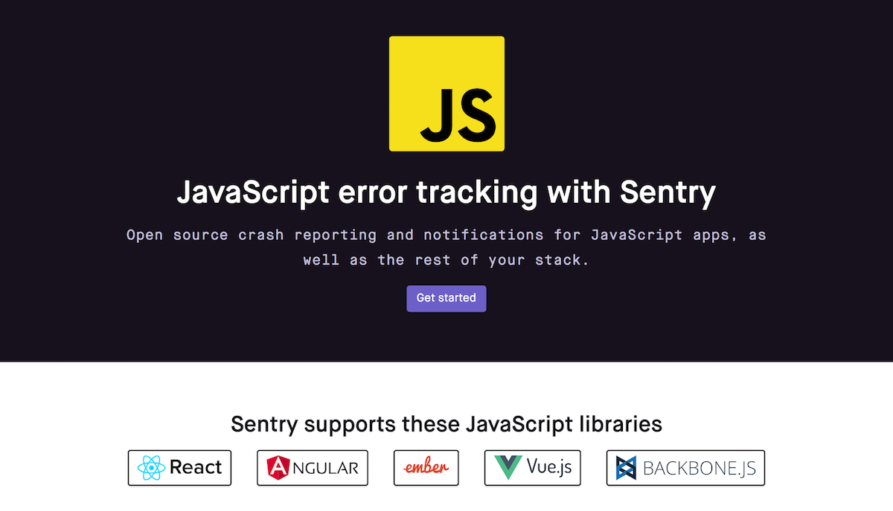

# SQUEEZE レガシーコード改善録

## バグゼロという未来に向けて

[PyCon mini Kumamoto 2017][1] | 2017/04/23 | Masataka Arai


[1]: http://kumamoto.pycon.jp/

----

## お前誰よ？


* Masataka Arai [@massa142][1]
* [SQUEEZE Inc.][2]
* [Pythonもくもく会][3]
* PyCon JP スタッフ

[1]: http://massa142.github.io/
[2]: https://squeeze-inc.co.jp/
[3]: https://mokupy.connpass.com/

----

## テーマ


-----

## バグゼロという『未来』に向けて

----

## 対象

* レガシーコードに苦しんでいる人
* チーム開発で困っている人
* スタートアップあるあるな苦しみを共感したい人

----

## おことわり

* 話すことはプロセス・メンタルについてが多め
* Pythonについては少なめ

----

## 目次

1. SQUEEZEの過去
2. 改善のための取り組み
3. SQUEEZEの現在
4. バグゼロという未来に向けて

----

# 1. SQUEEZEの過去

----

## 2016/04

１年前に入社したときのSQUEEZEは・・・

----

## 開発プロセス

* 本質的ではない指摘に終始するコードレビュー
* テストコードがほとんど存在しない
* エラーを全て検知できていない
* 度重なるバグ修正

----

## コード

* いわゆる不吉な匂いに満ちていた 💩


-----

## 匂うコード
 
* 重複したコード
* 長すぎるメソッド
* 巨大なクラス
* 長すぎるパラメータリスト
* 変更の発散
* データの群れ
* などなど

----

## スタートアップあるある 😇

+ スピード重視の開発
+ 少人数での開発
+ ピボットの繰り返し

----

# 2. 改善のための取り組み

----

## やってきたこと・意識したこと

+ コーディングスタイルの統一
+ Pull Requestのサイズを小さくする
+ テストコードを書く文化作り
+ エラートラッキング
+ 使っていないコードを破棄する
+ ボーイスカウトの規則
+ 割れ窓理論

----

## コーディングスタイルの統一

-----

## 過去の状況 😫

+ 明文化されたスタイルガイドは存在せず
+ 個人の好き嫌いでレビューが行われる
+ 表面的な指摘に終始して、本質的なレビューが不足しがち

-----

## 誰が書いても同じコード

+ メンテナンス性の高いコードにするために「誰が書いても同じ」ようにすることが大事
+ 「The Zen of Python」の精神を実践していく
  + Readability counts.

-----

## The Zen of Python

```text
>>> import this
The Zen of Python, by Tim Peters

Beautiful is better than ugly.
Explicit is better than implicit.
Simple is better than complex.
Complex is better than complicated.
Flat is better than nested.
Sparse is better than dense.
Readability counts.
Special cases aren't special enough to break the rules.
Although practicality beats purity.
Errors should never pass silently.
Unless explicitly silenced.
In the face of ambiguity, refuse the temptation to guess.
There should be one-- and preferably only one --obvious way to do it.
Although that way may not be obvious at first unless you're Dutch.
Now is better than never.
Although never is often better than *right* now.
If the implementation is hard to explain, it's a bad idea.
If the implementation is easy to explain, it may be a good idea.
Namespaces are one honking great idea -- let's do more of those!
```

-----

## スタイルガイド作成

以下をもとにSQUEEZEのPythonスタイルガイドを作成 📝

+ [PEP8][1]
+ [Google Python Style Guide][2]
+ [Django coding style][3]

[1]: https://www.python.org/dev/peps/pep-0008/
[2]: https://google.github.io/styleguide/pyguide.html
[3]: https://docs.djangoproject.com/en/dev/internals/contributing/writing-code/coding-style/

-----

## コードレビュー

* スタイルガイドによるチェックなどのLint作業は機械にやらす
* それ以外のコードレビューは人間がやる
* 「シングルクオートに統一してください」「importの順番を整えてえてください」なんて人間がやる仕事ではない
* [些末なコードレビュー - naoyaのはてなダイアリー][1]

[1]: http://d.hatena.ne.jp/naoya/20140313/1394664578

-----

## Lintプラグイン

SQUEEZEが使用しているのはこんな感じ

* [flake8][1]
* [flake8-coding][2]
* [flake8-commas][3]
* [flake8-isort][4]
* [flake8-quotes][5]
* [pep8-naming][6]

[1]: https://pypi.python.org/pypi/flake8
[2]: https://pypi.python.org/pypi/flake8-coding
[3]: https://pypi.python.org/pypi/flake8-commas
[4]: https://pypi.python.org/pypi/flake8-isort
[5]: https://pypi.python.org/pypi/flake8-quotes
[6]: https://pypi.python.org/pypi/pep8-naming

----

## Pull Requestのサイズを小さくする

-----

## 過去の状況 😫

+ 複数のことを一つのPRでやっていて、複雑なコードになりがち
+ diffが膨大でレビューに時間がかかる
+ 事前共有がないので、レビュー後の手戻りが大きい
+ レビュアー・レビュイーともに疲弊
+ コードレビューの質を低くしていた

-----

## Dangerの導入

+ [Danger - Stop Saying "You Forgot To…" in Code Review](http://danger.systems/)
+ Ruby gem

> Danger runs during your CI process, and gives teams the chance to automate common code review chores.

-----

## Dangerfile

```text
# set the number of lines that must be changed before this classifies as a "Big PR"
@S_BIG_PR_LINES ||= 500

# Warn when there is a big PR
warn("Big PR -- consider splitting it up into multiple changesets") if git.lines_of_code > @S_BIG_PR_LINES
```

-----


-----

## WIP Pull Requestの推奨

* Work In Progress 🚧
* アーキテクチャやテーブル設計などを前もってレビュー
  * レビュアーの負担・レビュイーの手戻りを軽減

----

## テストコードを書く文化作り

-----

## 過去の状況 😫

* テストコードがほとんど存在せず
* 状態を持ちすぎて、テストが書きやすいコードではない

-----

## できるところからコツコツと

* 新規のコード・バグ修正コードに対しては必ずテストを書く
* 既存のコードは、切り出せるところから少しずつ
* テストが書けないような既存コードは、requestテストで担保

-----

## テストカバレッジを見える化

* テストへの意識を高めるために、カバレッジを見える化 👀
* 数字が目にはいってくることで、強制しないでも自然とテストを書く文化に（予想外 😳）

----

## エラートラッキング

-----

## 過去の状況 😫

* エラーを全て検知できていなかった
* 特にフロントエンドにおけるJSエラー

-----

## Sentryの導入

* [Sentry][1]
* Python(Django)製

> Sentry’s real-time error tracking gives you insight into production deployments and information to reproduce and fix crashes.

[1]: https://sentry.io/

-----



----

## 使っていないコードを破棄する

-----

## 過去の状況 😫

* 使わなくなったコードを残しておく文化
  * 「いつかまた使うかも」
  * 「頑張って実装したのにもったいない」
* 見通しが悪くなって、バグを産みやすいコードに

-----

## 断捨離

* 有無を言わせずに要らないコードは削除 🗑
* だんだんと捨てる喜びを知ってもらう

----

## ボーイスカウトの規則

> "アメリカのボーイスカウトにはシンプルな規則があります。「自分のいた場所は、そこを出て行くとき、来た時よりもきれいにしなければならない」というものです。
これは、実装作業にも当てはまります。コードは何度も洗練され続けなければならないからです。"

* http://d.hatena.ne.jp/asakichy/20100706/1278377244

-----

## 日々の積み重ね

* 自分がさわったコードはリファクタリングして綺麗にする
  * 変数名を直すとかちょっとしたことでもOK
* 「日々コードの品質を向上させていく」という心がけが大事

----

## 割れ窓理論

> "長期間修理されることのない割れた窓が１枚でもあると、ビルの住人に「投げやりな（ビルの状態など気にもかけないようになる）感覚」が植えつけられていきます。すると、次の窓が割れます。さらに、ゴミが撒き散らかるようになります。落書きもされるようになります。
 このようにして、たった1枚の割れた窓から、建物全体に対する深刻な破損が起こり始めるのです。これが「割れ窓理論」です。"

* http://d.hatena.ne.jp/asakichy/20101217

-----

## ソフトウェアの「割れた窓」

* 「他の箇所のコードも酷いんだから、ここも適当でいいでしょ」
* 自分がコードを書いている時・コードレビュー時に妥協しないことが大事

----

## 3. SQUEEZEの現在

----

## コードレビュー

* コーディングスタイルの統一
* Pull Requestのサイズを小さくする


=> 本質的なレビューを行うことができるように 😊

----

## テストコード

* できる箇所から地道にコツコツと
* テストカバレッジを見える化して意識させる

=> テストを書く文化の醸成 😊

=> カバレッジ率 50%弱まで到達 📈

----

## エラー検知

* エラートラッキングツールの導入

=> バックエンド・フロントエンド 両方のエラーを検知可能に 😊

----

## コード品質

* コード断捨離
* ボーイスカウトの規則
* 割れ窓理論

=> Hotfix 対応回数の減少 😴

=> ユーザー・エンジニア両方が幸せに 🤗

----

## 4. バグゼロという未来に向けて

----

## 残っている課題

* スケールしづらいデータベース設計
  * 根本的なデータ構造に足を引っ張られている
* テストの充実
  * カバレッジ50%弱なので、まだまだ
* モノシリックなアーキテクチャからマイクロサービス化へ
  * 複数プロジェクトから使えるような基盤作り
  * 抽象度を高めてテストがしやすいように
* 機能断捨離
  * 使っていないコードの断捨離だけでなく、プロダクトオーナーと協力してユーザが必要だと感じていない機能の整理

----

## 銀の弾丸などない 

* レガシーコードはこれまで通りコツコツ潰していくしかない

----

## オレ達の戦いは これからだ！！


----

## おまけ

----


-----


-----

*PyCon JP 2017 でまたお会いしましょう 👋*

----

## ご静聴ありがとうございました 🙏
